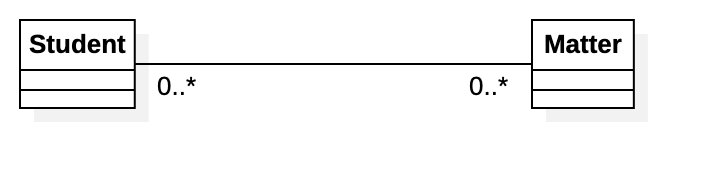
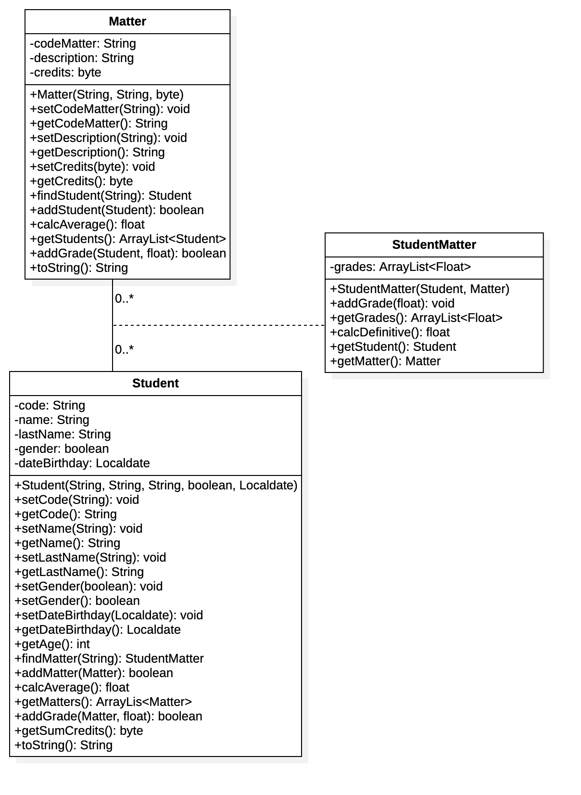

# Clases Asociación

En un Diagrama de clases se encuentran diferentes tipos de asociaciones, por ejemplo:

- Dependencia
- Generalización o Herencia
- Bidireccional
- Dirigida

Cada asociación indica la forma en que se relacionan los objetos o instancias unos con otros y permite el envío de mensajes entre objetos (ejecución de métodos).

Cuando una asociación, tiene características, es decir que puede tener atributos, es a la vez una asociación y una clase, llamada ___clase asociación___. Normalmente una clase asociación es una analogía en Modelos Relacionales de la entidad que rompe una relación de muchos a muchos. En la vida real se encuentran muchos ejemplos en donde el tipo de relación es de uno a muchos:

- Cliente con Facturas. Un cliente puede tener una o muchas facturas, y una factura pertenece a uno y solo un cliente.
- Un estudiante tiene uno o varias cuentas de email, y una cuenta de email pertenece a uno y solo un estudiante.

En un Diagrama de Clases se asocian las dos clases con un tipo de asociación dirigida (unidireccional) o binaria (en ambos sentidos) y con una cardinalidad de uno a muchos. Para la implementación en un Lenguaje de Programación se usan arreglos o colecciones para asociar un objeto con muchas instancias de otra clase.

Cuando entre dos clases se da el caso de una cardinalidad de muchos en forma recíproca, se debe usar una clase de asociación para establecer la asociación entre las clases, que viene siendo una clase con atributos. Ejemplo de este tipo de asociaciones pueden ser:

- Un estudiante inscribe varias materias y un materia es inscrita por varios estudiantes.  La clase de asociación podría tener las notas de la materia para el estudiante.
- Durante la vida laboral de un empleado puede haber tenido varios cargos (no al mismo tiempo) y un cargo puede haber sido desempeñado por varios empleados. La clase de asociación puede contener el salario, la fecha de inicio y fin, entre otros.

Normalmente la necesidad de una clase de asociación depende de la información que se desea conocer por los interesados en el sistema.

## Ejemplo

Como dominio del problema se toma el escenario del estudiante con sus materias. En la siguiente imagen se observa la asociación con cardinalidad de muchos en forma recíproca. 



La implementación en un Lenguaje de Programación debe definir en Estudiante un Arreglo de Materias y a su vez, en Materia un arreglo de Estudiantes. Esto no es conveniente por cuanto habría duplicidad en los datos, ya que tanto Estudiante como materia deben indicar una instancia única con sus atributos que caracterizan a cada instancia. No serían claras las siguientes situaciones:

- Cómo se soportan o almacenan las notas?, en Estudiante o Materia?
- Cómo se identifica que unas notas pertenecen a una materia para determinado estudiante?

Se debe tener en cuenta que por ejemplo, la materia Calculo es única, la cual se identifica por un código único y que tiene un determinado número de créditos.  Entonces no se deben tener instancias diferentes para Cálculo, ya que de cambiar por ejemplo el número de créditos, entonces se debería cambiar cada instancia, en vez de mantener una misma referencia de la clase.

La solución es la clase de asociación representada en la imagen del siguiente Diagrama de Clases.



La clase de asociación _StudentMatter_ se puede pensar en término de bases de datos como una tabla de vinculación, en el Diagrama de Clases representa una asociación que tiene atributos y/o comportamiento. En este caso se almacenan las notas del estudiante para una materia a través de la colección `grades`.  La clase asociación se representa a través de una línea punteada que se une a la asociación de las clases que vincula. En este caso _StudentMatter_ se une a la asociación entre _Student_ y _Matter_ a través de la línea punteada.  Este tipo de asociación permite dar respuesta necesidades que no es posible sin ella, por ejemplo:

- Almacenar las notas de un Estudiante para una determinada Materia
- Calcular la nota definitiva de una materia con base en las notas parciales.
- Calcular el promedio del estudiante, promediando las notas definitivas de todas sus materias inscritas
- Obtener un listado de estudiantes que están cursando determinada materia.
- Calcular el promedio general de una materia, promediando las definitivas de todos los estudiantes que cursan la materia respectiva

### Aspectos de Implementación

Para implementar la asociación en un Lenguaje de Programación se debe realiar las siguientes acciones:

- En cada clase vinculada definir un arreglo o colección que almacene instancias de la clase que las asocia
- En la clase asociación definir instancias para cada una de las clases que vincula. 

___Clase Student___

```java
public class Student {
    private String code;
    private String name;
    private String lastName;
    private boolean gender;
    private LocalDate dateBrithday;
    private ArrayList<StudentMatter> matters;
}
```

___Clase Matter___

```java
public class Matter {
    private String codeMatter;
    private String description;
    private byte credits;
    private ArrayList<StudentMatter> students;
}
```

___Clase StudentMatter___

```java
public class StudentMatter {
    private Student student;
    private Matter matter;
    private ArrayList<Float> grades;
}
```

Para aspectos como agregar notas, es necesario que el comportamiento se defina y se implemente en cada clase vinculada, lo anterior por cuanto cada una de esta clase tiene una referencia o instancia diferente de la clase de asociación, entonces es necesario que cada instancia contenga sus respectivas notas. En el código se debe asegurar la integridad y coherencia de los datos, es decir, que cada arreglo o colección contenga las mismas notas, lo anterior sería responsabilidad de una clase superior encargada de gestionar las clases principales y que no está contemplada en el modelo.